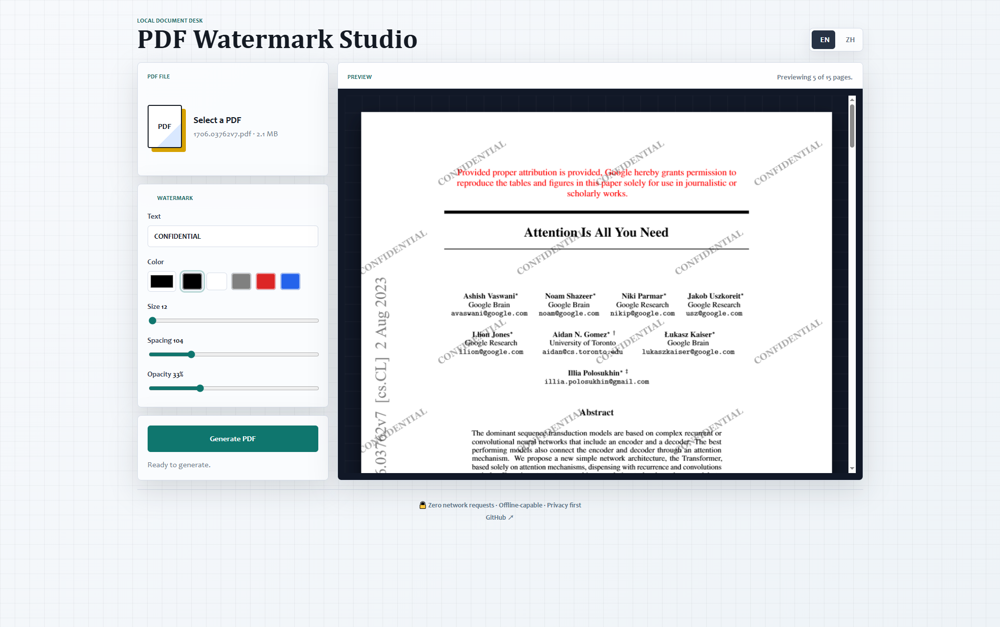

# PDF Watermark Studio

[Chinese](README.zh-CN.md)

PDF Watermark Studio is a local-first web app for adding tiled text watermarks to every page of a PDF. It runs entirely in the browser, previews the first five pages, and lets users adjust watermark text, color, size, spacing, and opacity before generating a new PDF.

## Preview



## Privacy Model

- PDF files are read in the browser and are never uploaded by the app.
- The app does not load dependencies from a CDN at runtime. Vite bundles `pdf-lib`, `pdfjs-dist`, and app code into static assets.
- Watermark configuration is saved with `localStorage` so the next visit restores the last text, color, size, spacing, and opacity values.
- Selected PDF files and generated PDF bytes are not stored in `localStorage`.

## Design

The app is a static Vite application with no backend service.

- `index.html` defines the application shell, form controls, preview canvas, language switcher, and footer.
- `src/app.js` owns browser event handling, PDF preview rendering, localized UI updates, and download generation.
- `src/watermark-core.mjs` contains shared watermark defaults, validation, layout helpers, preview page limits, quick colors, and file-name generation.
- `src/pdf-watermark.mjs` uses `pdf-lib` to embed the selected PDF, draw the watermark tiles on every page, and serialize the output PDF.
- `src/settings-storage.mjs` persists only normalized watermark settings in browser `localStorage`.
- `src/i18n.mjs` provides English and Chinese UI strings.
- `src/styles.css` contains the responsive two-column tool layout and scrollable multi-page preview area.
- `tests/` contains lightweight Node-based tests for configuration, i18n parity, layout constraints, storage behavior, and watermark helpers.

PDF preview uses `pdfjs-dist` to render pages into canvas images. PDF output uses `pdf-lib` to edit the original PDF bytes. This split keeps preview rendering and PDF writing explicit and testable.

## Runtime Requirements

- Node.js `^20.19.0` or `>=22.12.0`
- npm

## Local Development

Install dependencies:

```bash
npm install
```

Start the development server:

```bash
npm run dev
```

Run tests:

```bash
npm test
```

Build the static site:

```bash
npm run build
```

Preview the production build:

```bash
npm run preview
```
